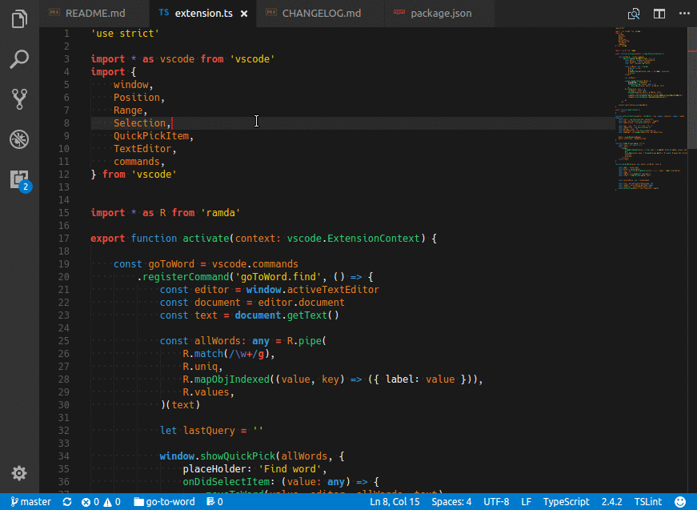

# Go to Word

Go to any word in current file, work like Sublime Text `Goto # (ctrl+;)`.

It works similar to command `Go to Symbol in File` but it also searching in **comments, strings, variables** and supports any file type.

## Setup

Add to `keybindings.json` file
```json
{
    "key": "ctrl+e",
    "command": "goToWord.find"
}
```


